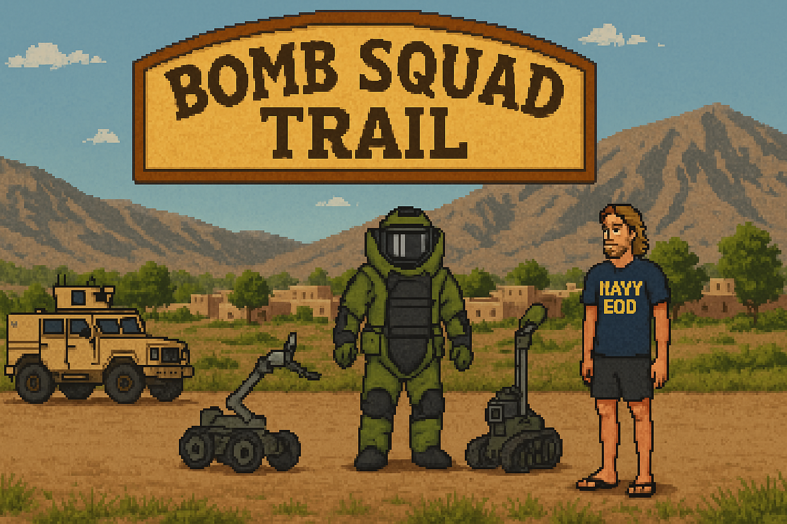

# bomb_squad_trail
Retro style take on the Oregon Trail, following a Navy EOD team through a deployment

# 🇺🇸 Bomb Squad Trail  
_A Retro Game Honoring Navy EOD – Celebrating Memorial Day_

 <!-- Use your own celebratory image here -->

## 🎖️ In Tribute on Memorial Day

This project is more than a game – it’s a salute to the courage, sacrifice, and legacy of the United States Navy Explosive Ordnance Disposal (EOD) community.

On this Memorial Day, we honor the heroes who’ve served, the teammates who made the ultimate sacrifice, and the families and friends who carry on their legacy. _We remember, and we celebrate the spirit of service._

---

## 🎮 About Bomb Squad Trail

_Bomb Squad Trail_ is a retro-inspired video game in the tradition of Oregon Trail, putting you in the boots of a Navy EOD team. Travel through challenging terrain, face tense scenarios, and learn about the people who keep others safe by taking on the world’s most dangerous jobs.

We built this as a fun way to bring people together to learn about Navy EOD’s history, achievements, and sacrifices – and to keep their stories alive.

---

## 👨‍✈️ Who Are Navy EOD?

- [About Navy EOD – NSOF](https://www.nsof.org/pages/explosive-ordnance-disposal)
- Navy EOD are the United States Navy’s tactical bomb disposal experts – trained to render safe explosive threats from IEDs to sea mines.
- Their legacy is one of courage, innovation, and brotherhood.

---

## 🕊️ Remembering Our Fallen

Every Memorial Day, we especially remember those who gave their lives in service.  
Meet the heroes, read their stories, and never forget:

- [Never Forgotten – NSOF](https://www.nsof.org/pages/never-forgotten)

### 🎥 Watch: Never Forgotten (Navy EOD Memorial Video)

  
> _Click to watch on YouTube or view below (if supported):_

  
Click to expand video embed

  
   
  <iframe width="560" height="315" src="https://www.youtube.com/embed/GRvZ9lHSL_0" frameborder="0" allowfullscreen></iframe>

---

## 🤝 How to Help

Support the Navy EOD community through the [Navy Special Operations Foundation](https://www.nsof.org/pages/how-to-help).  
Every contribution makes a difference for EOD warriors and their families.

---

## 🚩 Get Involved

- **Play & Share:** Have fun with the game, and share it to spread awareness!
- **Contribute:** Open-source project – new levels, art, music, and code always welcome.
- **Connect:** If you’re EOD, a veteran, family, or supporter – we’d love your ideas and stories. Open an issue or start a discussion!

---

## 🙏 A Final Word

**Memorial Day is a time to remember, reflect, and carry on the legacy of service.  
Thank you to all who serve, have served, and have given everything for our freedom.**

_EOD: First In, Last Out, Never Forgotten._

---

### [Learn More about Navy EOD and the Navy Special Operations Foundation →](https://www.nsof.org/pages/explosive-ordnance-disposal)
